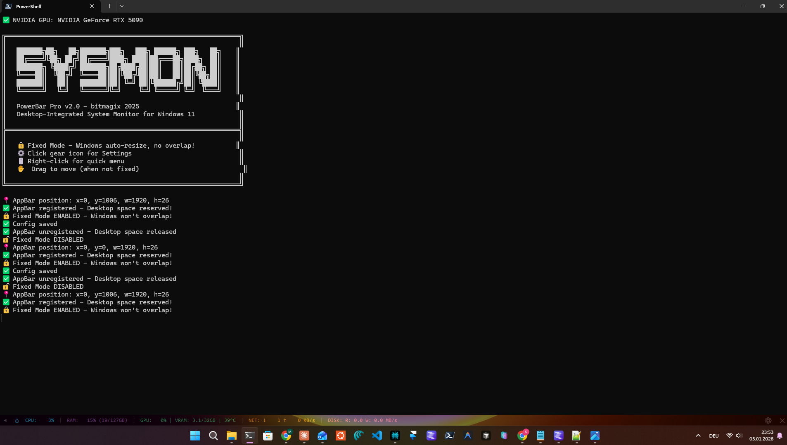

# SysMon PowerBar Pro

**Desktop-Integrated System Monitor for Windows 11**

   

A sleek, transparent status bar that displays real-time CPU, RAM, GPU (NVIDIA), Network, and Disk activity - docked right above your Windows taskbar!

## ✨ Features

- 🖥️ **Real-time Monitoring**: CPU, RAM, GPU, VRAM, Temperature, Network, Disk I/O
- 🔒 **Fixed Mode**: True desktop integration - windows automatically resize and DON'T overlap!
- 🎨 **Fully Customizable**: Colors, transparency, font size, position
- ⚡ **Windows Autostart**: Optional launch with Windows
- 🎯 **Minimal Footprint**: Just a thin bar, no window clutter
- 📦 **Portable**: Single EXE, no installation required

## 📸 Screenshot



*PowerBar showing CPU, RAM, GPU (RTX 5090), VRAM, Temperature, Network and Disk activity*

## 🚀 Quick Start

### Option 1: Download EXE (Recommended)
1. Download `SysMonPowerBar.exe` from [Releases](../../releases)
2. Double-click - done!

### Option 2: Run from Source
```powershell
git clone https://github.com/bitmagix/sysmon-powerbar.git
cd sysmon-powerbar
python -m venv venv
.\venv\Scripts\Activate.ps1
pip install -r requirements.txt
python powerbar_pro.py
```

## 🖱️ Controls

| Action | Function |
|--------|----------|
| **Right-click** | Context menu (Settings, Fixed Mode, Exit) |
| **Double-click** | Collapse/expand bar |
| **Drag** | Move bar (when not fixed) |
| **⚙ Click** | Open settings |
| **✕ Click** | Exit |

## 🔒 Fixed Mode - The Killer Feature!

Enable **Fixed Mode** and PowerBar reserves actual screen space:
- Maximized windows automatically stop ABOVE the bar
- No more overlapping!
- Works just like the real Windows taskbar

Enable: `Right-click → Fixed Mode` or in Settings.

## ⚙️ Settings

Settings are automatically saved to:
```
%USERPROFILE%\.sysmon\config.json
```

### Customizable Options:
- **Transparency**: 50% - 100%
- **Height**: 20 - 40 pixels
- **Font Size**: 8 - 14pt
- **Colors**: Individual color for each stat
- **Display**: Choose which stats to show
- **Update Interval**: 0.5 - 5 seconds
- **Position**: Top or Bottom
- **Temperature**: Celsius or Fahrenheit
- **Autostart**: Launch with Windows

## 🛠️ Build EXE

```powershell
.\build_exe.bat
```
The finished EXE will be in `dist\SysMonPowerBar.exe`

### Requirements:
- Python 3.10+
- Windows 10/11
- NVIDIA GPU (optional, for GPU monitoring)

## 📦 Dependencies

- `psutil` - CPU, RAM, Disk, Network stats
- `nvidia-ml-py` - NVIDIA GPU monitoring (optional)
- `tkinter` - GUI (included in Python)

## 🤝 Contributing

Pull requests are welcome! For major changes, please open an issue first.

## 📄 License

MIT License - see [LICENSE](LICENSE)

---

Made with ❤️ by [bitmagix](https://github.com/bitmagix) & Claude AI 🤖
